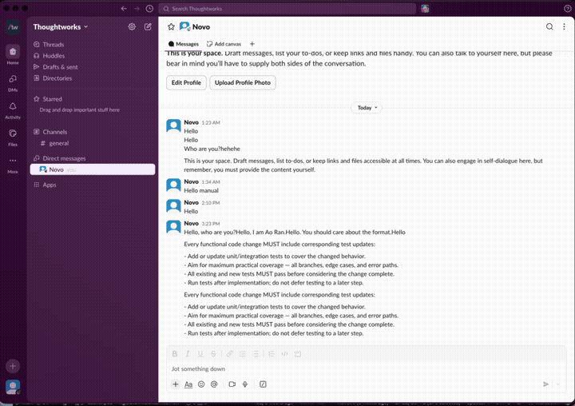
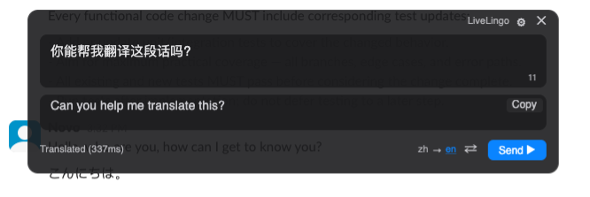
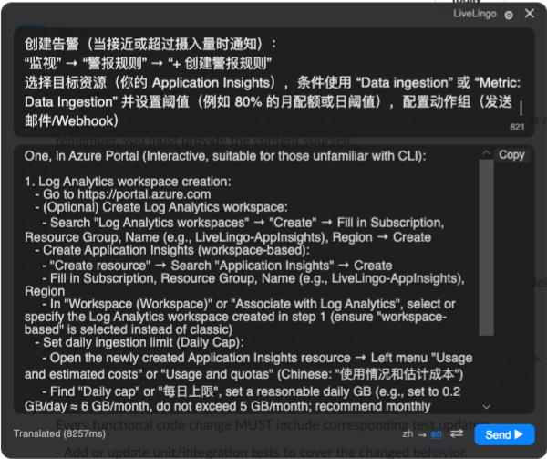
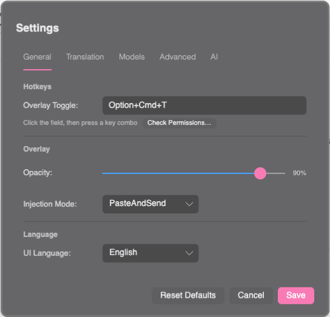
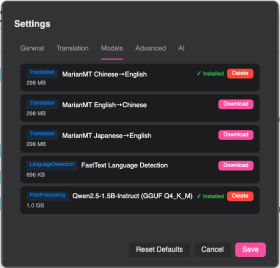

# 🌐 LiveLingo

**Your words, any language, zero cloud. Instantly.**

A privacy-first, AI-powered desktop translator that lives in your menu bar.  
Press a hotkey → type → get your translation → send it. All offline. All local. All yours.

---

## Why LiveLingo?

You're chatting with a colleague in Tokyo. Mid-conversation, you need to reply in Japanese — but your Japanese is… *creative* at best. You could open a browser, navigate to some translation site, copy-paste, wait for the response, copy-paste again…

**Or you could just press `Ctrl+Alt+T`.**

LiveLingo pops up as a sleek floating overlay — right where you're working. Type your message, get an instant AI translation, and hit **Send**. The translated text lands directly into the app you were using. No tab-switching. No copy-paste gymnastics. No data leaving your machine.

> 💡 Think of it as having a personal interpreter sitting inside your keyboard.

---

## ✨ Features

### 🔒 100% Offline & Private

Your text never leaves your computer. LiveLingo runs a local AI model ([Qwen2.5-1.5B](https://huggingface.co/Qwen)) — no API keys, no cloud services, no "we may use your data to improve our products" surprises.

### ⚡ Ridiculously Fast

Translation in **~300ms**. The overlay appears instantly with a global hotkey. Type, translate, send — all in one fluid motion.

### 🌍 10 Languages

Chinese, English, Japanese, Korean, French, German, Spanish, Russian, Arabic, and Portuguese. Mix and match source and target languages freely.

### 🎯 Smart Text Injection

Two modes to fit your workflow:

- **Paste Only** — drops the translation into your clipboard
- **Paste & Send** — pastes AND hits Enter for you (perfect for chat apps)

### 🪟 Beautiful Floating Overlay

A frosted-glass overlay that floats above everything. Drag it, resize it, adjust its transparency from 10% to fully opaque. The text automatically adapts contrast based on your opacity setting — readable on any desktop background.

### 🖥️ Cross-Platform

Native experience on both **Windows** and **macOS**. Platform-specific hotkey hooks, text injection, and UI polish on each.

### 🔄 Auto-Update

Built-in update system via [Velopack](https://velopack.io/) keeps you on the latest version without lifting a finger.

---

## 📸 Screenshots

<table>
<tr>
<td width="50%">

**Translation Overlay**  
*Floating, resizable, with adaptive transparency*

</td>
<td width="50%">

**Long Text Translation**  
*Handles paragraphs with ease*

</td>
</tr>
<tr>
<td width="50%">

**Settings — General**  
*Custom hotkeys, opacity, injection mode*

</td>
<td width="50%">

**Settings — AI Models**  
*One-click download and management*

</td>
</tr>
</table>

---

## 🚀 Getting Started

### Install

Download the latest release for your platform:

| Platform | Format | Download |
|----------|--------|----------|
| Windows  | `.exe` (auto-update) | [Releases](../../releases) |
| Windows  | `.msi` (traditional) | [Releases](../../releases) |
| macOS    | `.pkg`               | [Releases](../../releases) |

### First Launch

1. **Download the AI model** — LiveLingo will prompt you on first run. It's a one-time ~1 GB download.
2. **Set your hotkey** — Default is `Ctrl+Alt+T` (Windows) or `Option+Cmd+T` (macOS). Customize it anytime.
3. **Start translating** — Press the hotkey anywhere, type your text, and go.

> **macOS users:** Grant Accessibility and Input Monitoring permissions when prompted. LiveLingo needs these to register global hotkeys and inject text.

---

## 🤝 Contributing

Contributions are welcome! Whether it's a bug fix, new language support, or a feature idea — check the [Contributing Guide](CONTRIBUTING.md) to get started.

---

**Stop copy-pasting between translator tabs.**  
**Start LiveLingo-ing.** 🚀

